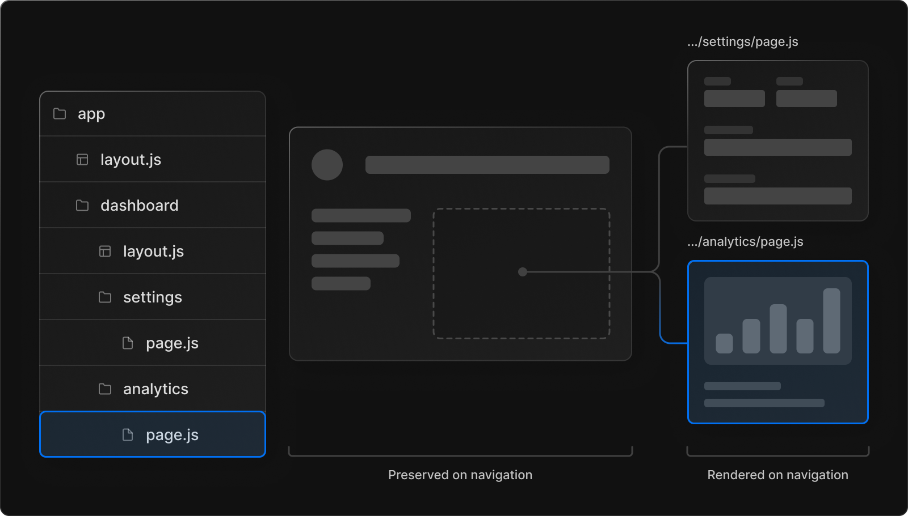
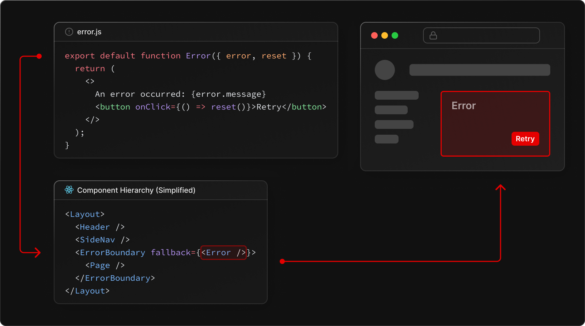
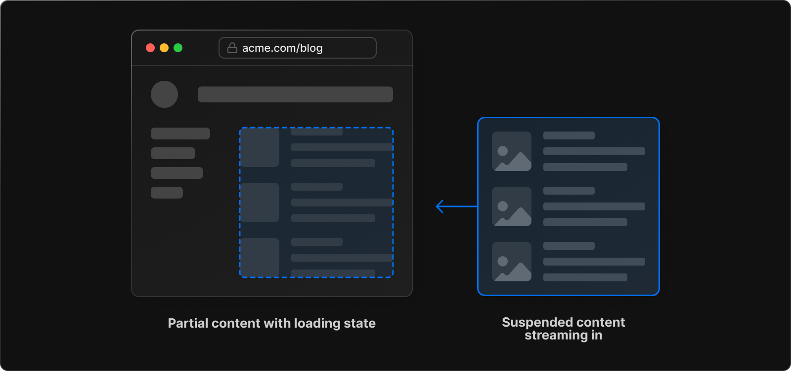
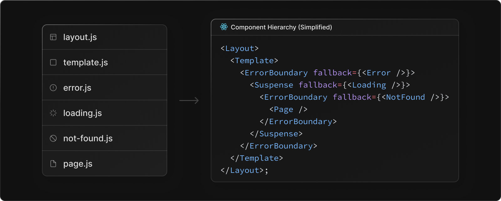
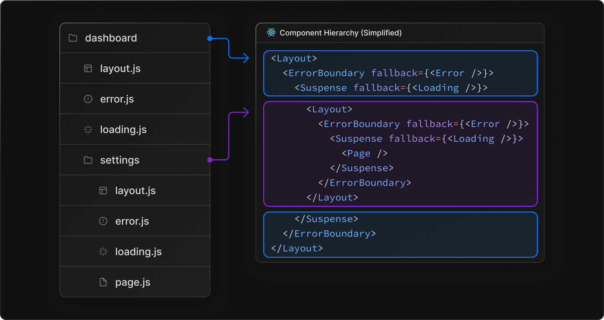

# Quadra Next.js

## Why Next.js?

Next.js is a production-ready React framework that comes with niceties out of the box. 5 Reasons To Use Next.js Over Plain React [Video](https://www.youtube.com/watch?v=I-zhncvdEGU). Docs for migrating from `create-react-app` are [here](https://nextjs.org/docs/migrating/from-create-react-app). Next basically has features like routing, code splitting, image optimization, and static site generation that make our lives as developers easier:

1. file system-based routing
   - Files and folders generate the URL structure for us.
   - routing with the app directory is controlled via the folders inside of it. The UI for a particular route is defined by a page.jsx file inside of the folder. e.g. `app/profile/settings/page.tsx` is the UI for the `/profile/settings` route.
2. Automatic code splitting
   - Next.js automatically code splits our app. This means that only the code needed for the current page is loaded. This makes our app load faster.
   - Dont need to use something like `react-loadable` or lazy load components. It is out of the box.
3. API Routes
   - Might need backend server to do more processing than a frontend server can do.
   - In the API folder, we have access to serverless functions that can run in a node environment. Can use node packages we need here.
   - This is useful for calculations that we may need to do on the frontend.
   - I want to use these for storing API Secret key etc. so we don't have this in the React front-end code. Have it hidden from the browser. This is a good place to store API keys.
4. Image Optomisation
   - Next.js optimizes images for us. It will automatically serve images in the best format for the browser. It will also resize images to the size they are displayed at. This means that we don't have to worry about resizing images ourselves.
   - For this, we use the `next/image` component. This component is a wrapper around the html `img` tag.
   - prop `layout='responsive'` will also serve the correct image file size based on the current browser size
   - Note that this requires a node server, so you **cannot do this in a static site.**
5. static site generation
   - Use Incremental Static Regeneration to update existing pages by re-rendering them in the background as traffic comes in.
   - All of the components inside the app folder are server components by default.
   - Put `'use client';` at the top of a file to make it a client component.
   - Need this where we are doing things like `handleClick` because all components in Next 13 by default are server components, therefore for client side interactivity you need to use `use client`.
6. Choose which data fetching strategy we want on a per-page basis.
   - data fetching in Next.js 13 differs from earlier versions.
   - All of the components inside the app folder are server components by default.
7. Partial Rendering
   - The router avoids unnecessary work by re-using segments that haven't changed (e.g. shared layouts) from the client-side cache.
   - When navigating between sibling routes (e.g. /dashboard/settings and /dashboard/analytics below), Next.js will only fetch and render the layouts and pages in routes that change. It will not re-fetch or re-render anything above the segments in the subtree. This means that in routes that share a layout, the layout will be preserved when a user navigates between sibling pages.
     
   - Without partial rendering, each navigation would cause the full page to re-render on the server. Rendering only the segment that’s updating reduces the amount of data transferred and execution time, leading to improved performance.
   - If created, loading UI is shown from the server while the payload is being fetched.

## Next.Js Changes made to old repository

Useful Reference for [Working with the app directory in Next.js 13](https://blog.logrocket.com/next-js-13-app-directory/)

Changes:

1. Next doesn't have an entry HTML file.
   - Any `<head>` code should be moved to a custom `_document.js`.
   - Any shared layout between all pages should be moved to a custom `_app.js`.
2. For routing, instead of using a third-party library (React Router), Next.js includes its own file-system based routing.
   - While still supporting the same file system-based routing, which uses the pages directory, the new `app` directory introduces the concepts of layouts, error components, and loading components while also leveraging React’s server components for building the UI
3. For global styles, made a custom `\_app.js` to add a global stylesheet.
4. Accessing web API's
   - With client-side rendered applications (like Create React App), you can access `window`, `localStorage`, `navigator`, and other Web APIs out of the box.
   - Since Next.js uses pre-rendering, we need to safely access those Web APIs only on the client-side
   - e.g:

```javascript
if (typeof window !== "undefined") {
  // You now have access to `window`
}
// =============OR================
import { useEffect } from "react";

useEffect(() => {
  // You now have access to `window`
}, []);
```

5. Environment Variables:
   - Changed all environment variables with the `REACT_APP_` prefix to `NEXT_PUBLIC_`.
   - Server-side environment variables will be available at build-time and in API Routes.
6. SEO. For this, we don't need `react-helmet` package anymore. With Next.js, we use `next/head` to add meta tags to `<head />` element

Next Features:

- `loading.tsx` file
  - An optional file that you can create within any directory inside of the app folder. It automatically wraps the page inside of a `React suspense boundary`. The component will be shown immediately on the first load as well as when you’re navigating between the sibling routes.
  - You can pre-render loading indicators such as skeletons and spinners, or a small but meaningful part of future screens such as a cover photo, title, etc.
- `error.tsx` file
  - An optional file that isolates the error to the smallest possible subsection of the app. Creating the error.tsx file automatically wraps the page inside of a React error boundary. Whenever any error occurs inside the folder where this file is placed, the component will be replaced with the contents of this component.
  - When the fallback error component is active, layouts above the error boundary maintain their state and remain interactive, and the error component can display functionality to recover from the error
  - Two props are passed to this component: the error prop provides more details about the error, and the reset function resets the error boundary
  - This should be enough to contain the error only to the component and preserve the UI as well as the state of the rest of the application.
  - The nested component hierarchy has implications for the behavior of error.js files across a nested route. Errors bubble up to the nearest parent error boundary. This means an error.js file will handle errors for all its nested child segments. More or less granular error UI can be achieved by placing error.js files at different levels in the nested folders of a route. An error.js boundary will not handle errors thrown in a layout.js component in the same segment because the error boundary is nested inside that layouts component.



- `layout.tsx` file
  - Used to define a UI that is shared across multiple places. A layout can render another layout or a page inside of it. Whenever a route changes to any component that is within the layout, its state is preserved because the layout component is not unmounted.
  - On navigation, layouts preserve state, remain interactive, and do not re-render.
- `template.tsx` file
  - similar to the `layout.tsx` file, but upon navigation, a new instance of the component is mounted and the state is not preserved.
  - Using layouts and templates allows us to take advantage of a concept known as **partial rendering**.
  - While moving between routes inside of the same folder, only the layouts and pages inside of that folder are fetched and rendered:
- [Route Handlers](https://beta.nextjs.org/docs/routing/route-handlers)
  - The following HTTP methods are supported: GET, POST, PUT, PATCH, DELETE, HEAD, and OPTIONS. If an unsupported method is called, Next.js will return a 405 Method Not Allowed response.
  - You can revalidate static data fetches using the next.revalidate option
  - Next.js allows you to update specific static routes without needing to rebuild your entire site. Revalidation (also known as Incremental Static Regeneration) allows you to retain the benefits of static while scaling to millions of pages.
  - To revalidate cached data at a specific interval, you can use the next.revalidate option in fetch() to set the cache lifetime of a resource (in seconds).
- [Server side Components](https://beta.nextjs.org/docs/rendering/server-and-client-components)
- Data Fetching
  - Although it's possible to fetch data in Client Components, we recommend fetching data in Server Components unless you have a specific reason for fetching data on the client. Moving data fetching to the server leads to better performance and user experience
  - data fetching can also happen closer to your data source, reducing latency and improving performance.
  - Perform multiple data fetches with single round-trip instead of multiple individual requests on the client.
  - Keep your application more secure by preventing sensitive information, such as access tokens and API keys, from being exposed to the client.
  - Automatic fetch() Request Deduping
  - To improve the user experience, you can add a suspense boundary to break up the rendering work and show part of the result as soon as possible:

```javascript
export default async function Page({ params: { username } }) {
  // Initiate both requests in parallel
  const artistData = getArtist(username);
  const albumData = getArtistAlbums(username);

  // Wait for the artist's promise to resolve first
  const artist = await artistData;

  return (
    <>
      <h1>{artist.name}</h1>
      {/* Send the artist information first,
      and wrap albums in a suspense boundary */}
      <Suspense fallback={<div>Loading...</div>}>
        <Albums promise={albumData} />
      </Suspense>
    </>
  );
}

// Albums Component
async function Albums({ promise }) {
  // Wait for the albums promise to resolve
  const albums = await promise;

  return (
    <ul>
      {albums.map((album) => (
        <li key={album.id}>{album.name}</li>
      ))}
    </ul>
  );
}
```

      move data fetching lower in the component tree to only block rendering for the parts of the page that need it. For example, moving data fetching to a specific component rather than fetching it at the root layout.

- Streaming and Suspense
  - Streaming and Suspense are new React features that allow you to progressively render and incrementally stream rendered units of the UI to the client.
    
- ASDF

Note React components defined in special files of a route segment are rendered in a specific hierarchy:

- `layout.tsx`
- `template.tsx`
- `error.tsx` (React error boundary)
- `loading.tsx` (React suspense boundary)
- `not-found.tsx` (React error boundary)
- `page.tsx` or nested `layout.tsx`



In a nested route, the components of a segment will be nested inside the components of its parent segment.



## Deployment

[Deploy a Next.js 13 app to AWS with Amplify Hosting](https://aws.amazon.com/blogs/mobile/amplify-next-js-13/#:~:text=On%20the%20Build%20settings%20page,page%20in%20the%20Amplify%20Console.)

## Commands

First, run the development server:

```bash
npm run dev
```

## Notes

Open [http://localhost:3000](http://localhost:3000) with browser to see the result.

[http://localhost:3000/api/hello](http://localhost:3000/api/hello) is an endpoint that uses [Route Handlers](https://beta.nextjs.org/docs/routing/route-handlers). This endpoint can be edited in `app/api/hello/route.ts`.

This project uses [`next/font`](https://nextjs.org/docs/basic-features/font-optimization) to automatically optimize and load Inter, a custom Google Font.

## Resource List

- [Next.js Documentation](https://nextjs.org/docs) - learn about Next.js features and API.
- [Next.js β Documentation](https://beta.nextjs.org/docs/routing/intercepting-routes) - learn about Next.js features and API.
- [Learn Next.js](https://nextjs.org/learn) - an interactive Next.js tutorial.
- [Next.js GitHub repository](https://github.com/vercel/next.js/)

## Links

- Precedent
  - https://vercel.com/templates/next.js/precedent
  - https://github.com/steven-tey/precedent
  - https://www.radix-ui.com/
